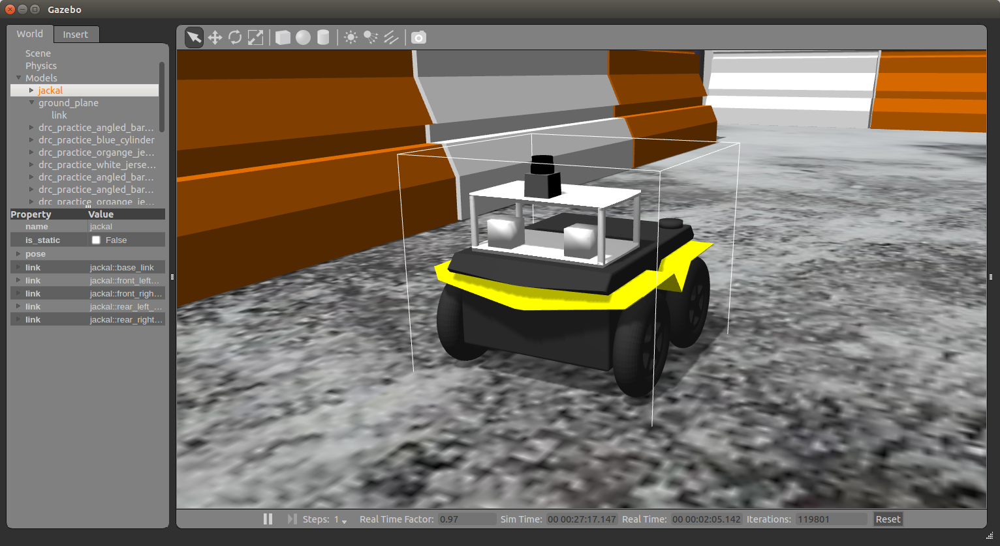
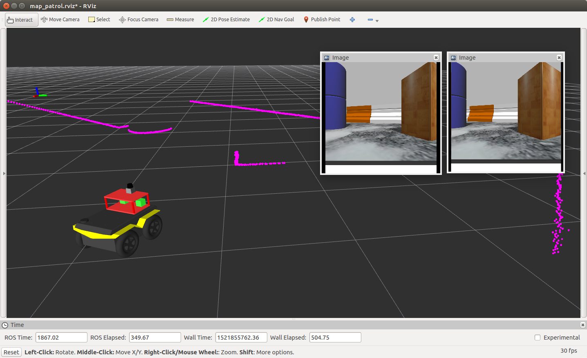

# Working with the Jackal



# Project objectives

1. Develop a URDF model for the sensor pod that includes approximate mass. Add the URDF model to the Jackal Description.
2. Calibrate the PS3 cameras using ROS camera calibration.
3. Define an appropriate TF in which to publish 'laser scan' data from the Hokuyo.
4. Combine the two camera nodes and the urg/LIDAR node into a single launch file that can be launched from the rsestudent account.
5. Demonstrate operation of the Jackal with LIDARs and calibrated camera images via rviz.

*****************************************************
*****************************************************

# INSTALL AND RUN

```
mkdir -p alice_ws/src
cd alice_ws
catkin_make
*git clone this repository to your current workspace*

cd alice_ws
catkin_make
source devel/setup.bash
```
Install necessary textures
```
cd alice_ws/src/alice
source prereq.sh
```
Launch simulation environment
```
cd alice_es
roslaunch alice_pkg newlaunch.launch
```
Run line-following script (in new terminal)
```
cd alice_ws
source devel/setup.bash
rosrun alice_pkg predator.py
```
## Launch files description

| Function name | Description                    |
| ------------- | ------------------------------ |
| `newlaunch.launch`      | Run the project with Gazebo and Rviz      |
| `spawner.launch`   | Spawn Jackal without sensor pod  |
| `urg_cams.launch` | Run cameras with the lidar separately |

*****************************************************
*****************************************************




*****************************************************
*****************************************************

# Connecting to the Jackal

Turn on the Jackal using the power button on the back panel. After some time the LED next to the wireless icon should light up as shown below.

Open a new terminal window and use ssh to connect to your jackal (username/password)

`ssh username@jackal_number`

Download and modify the following script: `remote-jackal.sh`. Modify the file to use the appropriate hostname (jackal1, jackal2, etc) and then source the file

Create a workspace on your Jackal, and follow the *INSTALL AND RUN* instruction given above.

## Run the project on the Jackal:

```
roslaunch alice_pkg newlaunch.launch

roslaunch alice_pkg urg_cams.launch

rosrun alice_pkg predator.py
```

*****************************************************
*****************************************************

