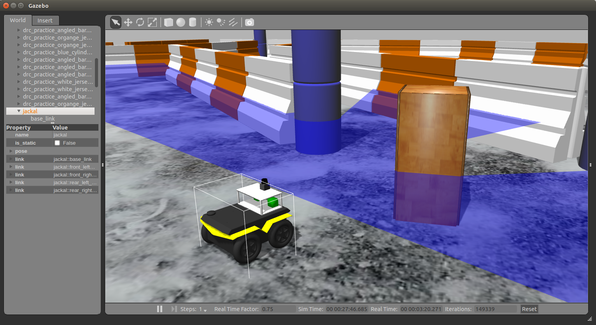

# Working with the Jackal


# Project objectives

1. Each team should use the same Jackal for the remainder of the class through to the final project. **Team 3 (Jackal 5).**
2. Teams should develop a URDF model for the sensor pod that includes approximate mass. Add the URDF model to the Jackal Description.
3. Calibrate the PS3 cameras using ROS camera calibration.
4. Define an appropriate TF in which to publish 'laser scan' data from the Hokuyo.
5. Combine the two camera nodes and the urg/LIDAR node into a single launch file that can be launched from the rsestudent account.
6. Demonstrate operation of the Jackal with LIDARs and calibrated camera images via rviz.
7. Demonstrate in simulation use your Jackal model to map the Jackal race world using work from previous projects.

*****************************************************
*****************************************************

## Guidelines for using the Jackal:

- Return the Jackal to a charging berth when not in use. Use the hull charging port and not the pig tail connector to charge the Jackal. Disconnect the hull charging port if the Jackal will be moving for any reason. Do not disconnect the pig tail connector at any time.

- The Jackals are expensive. Treat them with care.

- Make sure the Jackal is off when you connect it for charging. Press the power button once to turn it off. Otherwise, it is likely to reset rather than turn off.

- If you're having an issue that seems to be mechanical or electrical (not software) ask for help.

*****************************************************
*****************************************************

# INSTALL AND RUN

```
mkdir -p alice_ws/src
cd alice_ws
catkin_make
*git clone this repository to your current workspace*

cd alice_ws
catkin_make
source devel/setup.bash
```
Install necessary textures
```
cd alice_ws/src/alice
source prereq.sh
```
Launch simulation environment
```
cd alice_es
roslaunch alice_pkg newlaunch.launch
```
Run line-following script (in new terminal)
```
cd alice_ws
source devel/setup.bash
rosrun alice_pkg predator.py
```
## Launch files description

| Function name | Description                    |
| ------------- | ------------------------------ |
| `newlaunch.launch`      | Run the project with Gazebo and Rviz      |
| `spawner.launch`   | Spawn Jackal without sensor pod  |
| `urg_cams.launch` | Run cameras with the lidar separately |

*****************************************************
*****************************************************




*****************************************************
*****************************************************
# Taking the Jackal out for a drive

The objective of this assignment is to apply what you have learned from the previous assignments to real motors, circuits; a robot. In this case, the Clearpath Jackal. Each Jackal is equipped with a Hukoyu UST10-LX and two PS3 Eye Cameras on a sensor pod. . 

We'll cover connecting and using the Jackal in class. Check here if you need a refresher and refer to this page if your Jackal does not connect to Wi-Fi after a reboot. Share any tips on the discussion page for extra points.

*****************************************************
*****************************************************

# Connecting to the Jackal

Turn on the Jackal using the power button on the back panel. After some time the LED next to the wireless icon should light up as shown below.

Open a new terminal window and use ssh to connect to your jackal (username: rsestudent, password:rsestudent)

`ssh rsestudent@jackal5`

Download and modify the following script: `remote-jackal.sh`. Modify the file to use the appropriate hostname (jackal2,3, etc) and then source the file

Create a workspace on your Jackal, and follow the *INSTALL AND RUN* instruction given above.

## Run the project on the Jackal:

```
roslaunch alice_pkg newlaunch.launch

roslaunch alice_pkg urg_cams.launch

rosrun alice_pkg predator.py
```

*****************************************************
*****************************************************

